## Actividad 5: Construyendo un pipeline DevOps con Make y Bash

Damos permisos con chmod y comprobamos las herramientas esenciales
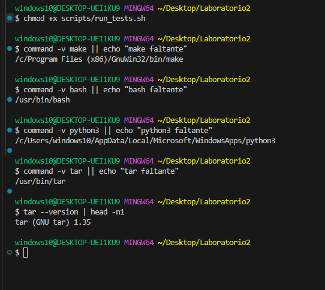 

Ademas instalamos/actualizamos las herramientas necesarias

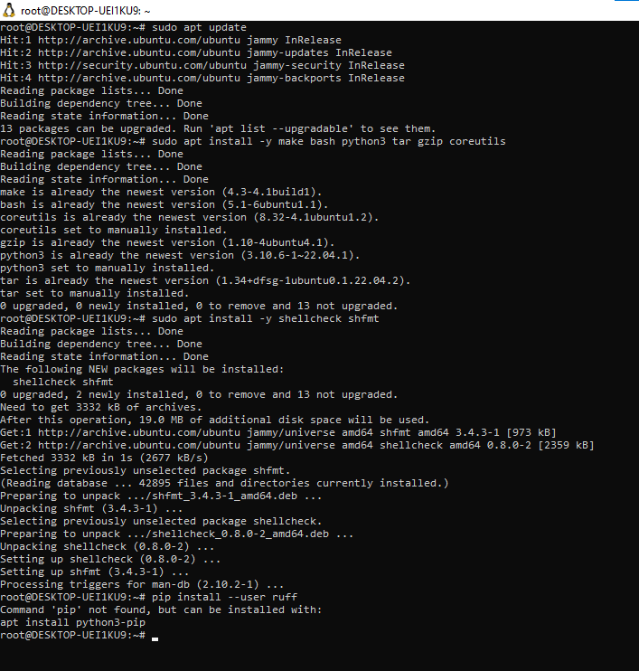 

Ahora ejecutamos make help para visualizar la ayuda y creamos las carpetas log, evidencia, artefactos y meta 
Ademas utilizamos .DEFAULT_GOAL para definir el objetivo (target) que se ejecutará por defecto cuando no se le indique un objetivo explícito en la línea de comando. 
Y la utilidad de .PHONY es para declarar que ciertos objetivos no corresponden a archivos reales. 

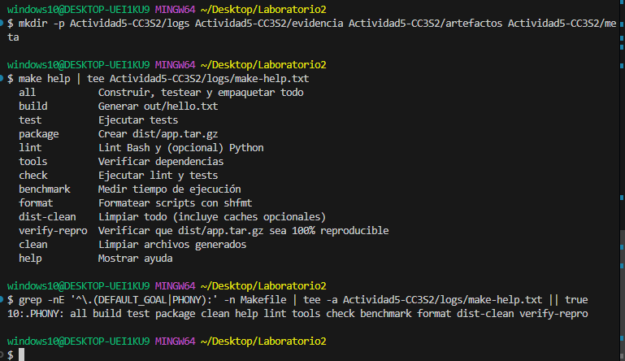 

Cargamos la ruta y ejecutamos el Makefile y el script hello.py en este entorno.

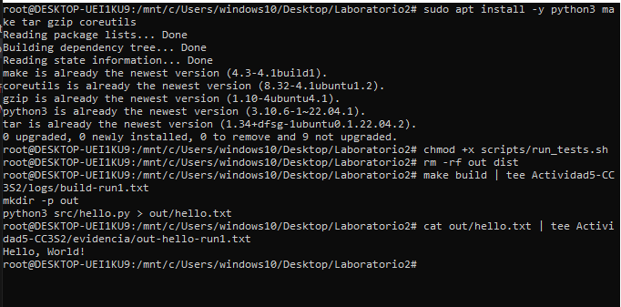

Vemos la diferencia entre la primera y segunda ejecución donde la primera crea artefacto, y la segunda no rehace porque target es más reciente que prerequisito, relación con marcas de tiempo y grafo de dependencias.
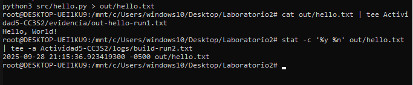

Ahora probamos un fallo intencional al usar una variable PYTHON=python4 para ejecutar make build, con el objetivo de forzar un error, verificar que el error se captura correctamente, confirmar que el archivo y guardar todo en los logs como evidencia del comportamiento esperado.

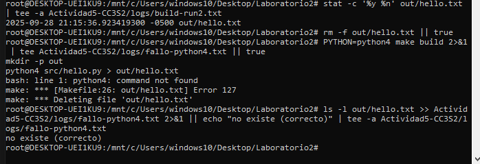

#### Dry-run y make -d 
Utilizamos make -n build -> dry-run que simula la ejecución sin hacer nada. Y luego el make -d build -> modo debug detallado para ver cómo make decide qué necesita construir y guardamos ambos como evidencia en logs

**Decisiones de `make` basadas en timestamps**

- `Considering target file 'out/hello.txt'`  
  `make` evalúa si debe reconstruir el archivo comparando la fecha de modificación del objetivo con sus dependencias.

- `Must remake target 'out/hello.txt'`  
  `make` decide recompilar porque el archivo no existe o está desactualizado respecto a sus dependencias.

`make` solo recompila archivos que estén desactualizados, optimizando así el proceso.

**Importancia de `mkdir -p $(@D)`**

- `$@` es el nombre del archivo objetivo (`out/hello.txt`).
- `$(@D)` es el directorio que contiene el archivo objetivo (`out`).

El comando `mkdir -p $(@D)` crea el directorio destino si no existe. Esto es necesario para evitar errores al intentar crear o escribir el archivo objetivo dentro de un directorio inexistente.

Evidencia: 
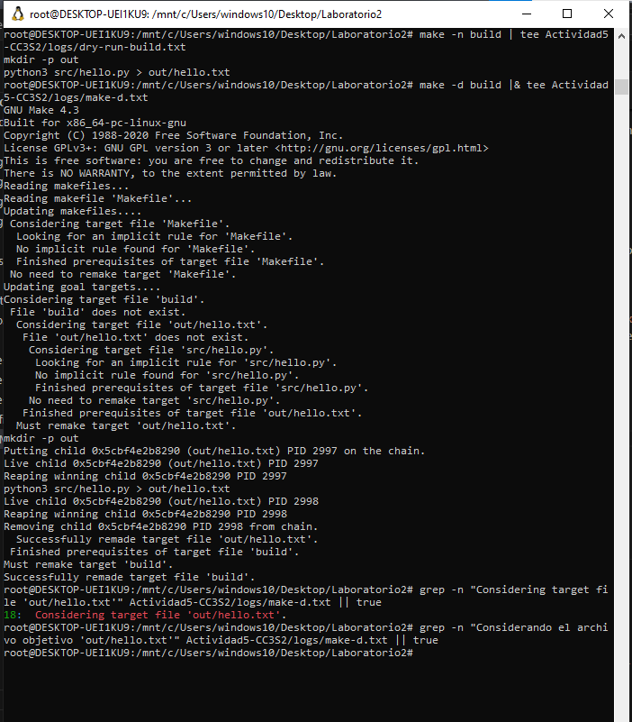

**`make build` tras modificar timestamps con `touch`**

- Al ejecutar `touch src/hello.py`, se actualiza la fecha de modificación del archivo fuente, dejándola más reciente que el archivo objetivo `out/hello.txt`.  
  Esto provoca que `make` considere el objetivo desactualizado y por lo tanto **reconstruya** `out/hello.txt` al ejecutar `make build`.

- Al ejecutar `touch out/hello.txt`, se actualiza la fecha del archivo objetivo, dejándola más reciente que la fuente.  
  Por esta razón, `make` interpreta que el objetivo ya está actualizado y **no realiza ninguna acción**, mostrando el mensaje: make: Nothing to be done for 'build'.

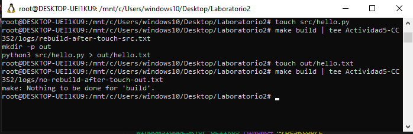

**Verificación manual de estilo y formato**

### Verificación manual de estilo y formato

Se ejecutaron las herramientas `shellcheck` y `shfmt` sobre el script `scripts/run_tests.sh` para verificar estilo y formato.

- `shellcheck` está instalado y detectó algunas advertencias menores relacionadas con el uso incorrecto de una tubería (`| true`). Se corrigieron estas advertencias para mejorar la calidad del código.  
- `shfmt` también está instalado y no mostró diferencias importantes, confirmando que el formato del script es adecuado.

Los resultados se registraron en los archivos de logs donde no hubo ninguna advertencia:

- `Actividad5-CC3S2/logs/lint-shellcheck.txt`  
- `Actividad5-CC3S2/logs/format-shfmt.txt`

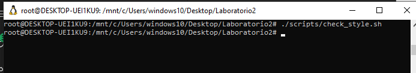

Creamos un archivo tar de `src/hello.py` con opciones que aseguran orden y fechas fijas donde comprimimos el tar con gzip usando la opción `-n` para evitar metadatos variables. Luego calculamos el hash SHA256 dos veces y verificaste que son idénticos. Esto confirma que el archivo generado es reproducible.

**Por qué usar esas opciones**
Estas opciones en conjunto permiten generar archivos comprimidos reproducibles, es decir, que siempre tengan el mismo contenido binario y hash, independientemente del sistema o momento en que se generen.
- `--sort=name`: garantiza que el contenido del archivo tar siempre esté en el mismo orden, evitando cambios por orden de archivos.
- `--mtime='@0'`: elimina la variabilidad causada por diferencias en fechas de modificación, que afectan el hash.
- `--owner=0 --group=0 --numeric-owner`: asegura que el tar tenga propietarios y grupos constantes, evitando variaciones por usuario o sistema.
- `gzip -n`: evita incluir metadatos variables (nombre, fecha) en el archivo comprimido, haciendo la compresión reproducible.

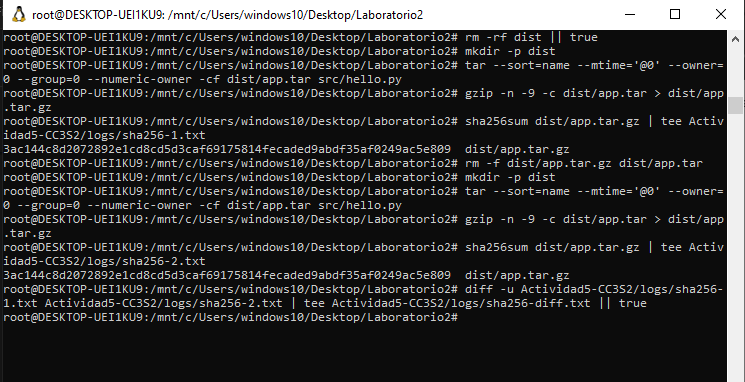

Cambios el tabulador por 4 espacios como dice la guia debido a que el Make exige que las líneas de receta comiencen con un carácter TAB, no con espacios. Esto es una regla estricta del lenguaje de Makefiles. Si se usan espacios en lugar de un TAB al inicio de una receta, Make muestra el error:

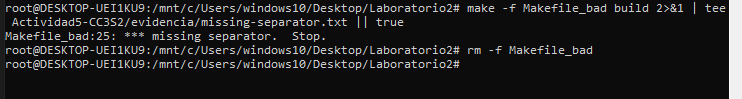

Ejecutamos el script de pruebas y luego verificamos si terminó correctamente o con error y notamos que no hubo error.

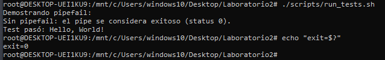

Romper src/hello.py temporalmente para provocar fallo y comprobar rollback donde este detectó que la salida ya no es la esperada.

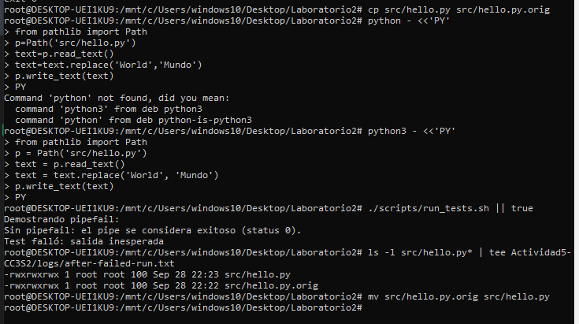

Ejecutamos el script con bash -x para obtener un trace detallado de cada línea, y confirmamos que el test pasó (exit 0) después de restaurar correctamente el archivo src/hello.py.

El uso de trap 'cleanup $?' EXIT INT TERM garantiza que se ejecute limpieza (rollback) siempre que el script termine, incluso por error o interrupción. Si el test falla (salida inesperada), el script sale con código 2, útil para distinguir fallos de pruebas de errores de sistema. 

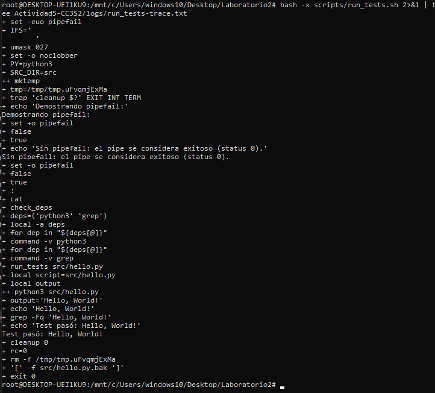

### Parte 2:

**Ejecutamos make -n all, make -d build, make verify-repro**

- El objetivo `all` encadena: `lint → build → test → package`, asegurando estilo, compilación, pruebas y empaquetado.

- En el log de `make -d`, líneas como `Must remake target` indican que Make detectó archivos desactualizados y los reconstruyó.  
  En cambio, `No need to remake` indica que no hubo cambios en los archivos fuente.

- La regla `verify-repro` comprueba que dos empaquetados consecutivos sean idénticos (`sha256sum`).

- Se usan opciones como `--sort=name`, `--mtime='@0'`, `--numeric-owner` y `gzip -n` para evitar variaciones en orden, fechas y metadatos.

- Si `verify-repro` falla, puede ser por diferencias entre sistemas (`tar` BSD vs GNU), zona horaria (`TZ`) o versiones de herramientas.

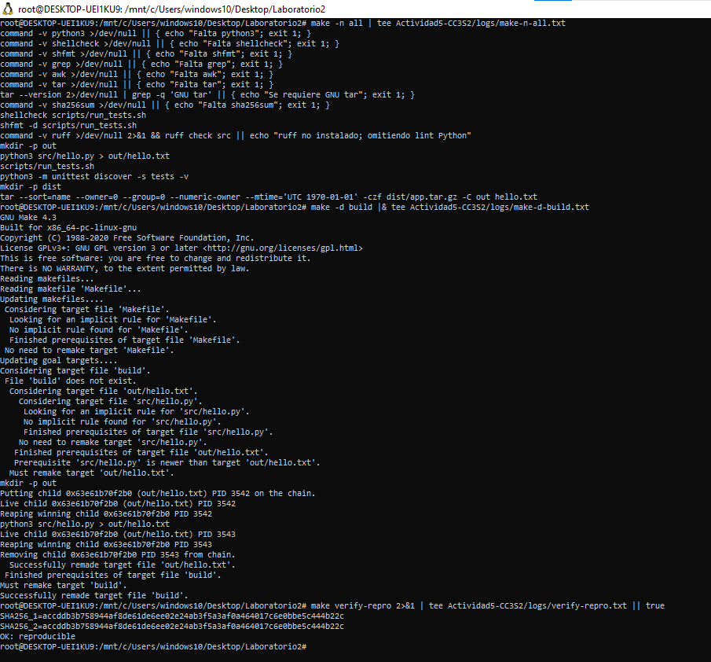

### Parte 3:

Ya habiamos creado las carpetas para guardar resultados y metadatos, asi que se copian archivos generados (`hello.txt`, `app.tar.gz`) a carpetas de artefactos. Luego se registra información del sistema y versiones de herramientas clave (`uname`, `make`, `bash`, `python3`, `tar`) en `meta/entorno.txt`. Y por ultimo se guarda el último commit de Git en `meta/commit.txt`.

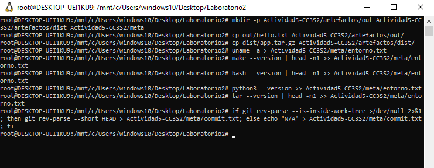

