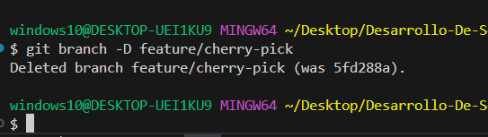

## Actividad 6: Introducción a Git conceptos básicos y operaciones esenciales

**Configuración inicial:**
Se creo una estructura inicial y se configuró el nombre y correo de usuario para asociar los commits

**Inicialización del repositorio**
Se omitio la inicializacion y verificacion del repositorio debido a que ya hay un repositorio.

**Commits iniciales**
Realizamos los primeros commits para el readme, contributing y main

Revisamos el historial de commits usando con log, creamos una rama y nos movemos a ella

**Conflictos y resolucion de conflictos**
Modificamos el main dentro de la rama y realizamos un merge para generar un conflicto

Ya hemos producido un conflicto en main.py y lo resolvimos manualmente editando el archivo y confirmando el merge.

**Logs guardados**
Revisamos el historial para ver cómo se ha integrado el commit

**Trabajo colaborativo y manejo de Pull Requests y abrir un pull request**

Creamos un nuevo repositorio remoto, lo clonamos y creamos una nueva rama
Luego realizamos cambios y creamos un pull request para realizar el merge

finalmente aceptamos el PR

finalmente eliminamos la rama remota y local con:

**Cherry-Picking y Git Stash**
Hacemos cambios en main.py y confirmarlos:

Aplicamos el commit específico y guardamos los cambios noc onfirmados

